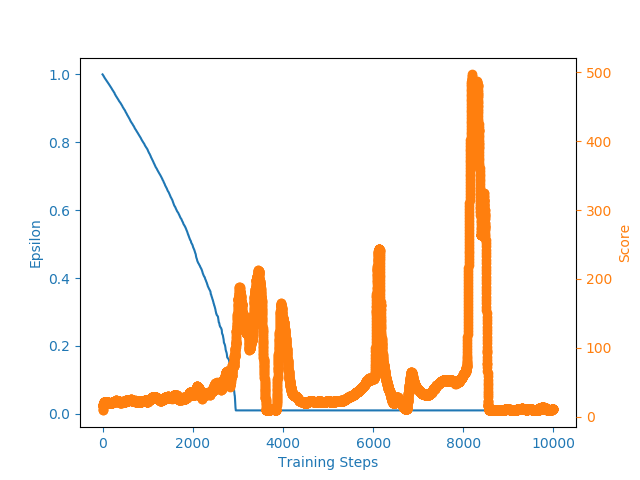

# Naive Deep Q Learning Cartpole

## Running the Code

To train and create plot run the following:
'''
python Cartpole.py
'''

This will train on a GPU if one is available.  If not it will train on a CPU.

Then it will create a plot.

This did not work, as you can see by the plot above, because we were using a nonlinear function approximator (neural network) to represent the Q function.  So it starts to learn then all of the sudden the agent forgets.

There are a few reason why this does not work:

* Small updates to Q can have significant changes to the policy.
* The correlation between the Q and target values.
* The correlations in the sequence of observations.

This is a great paper that can help understand these issues and how to overcome them: 
https://web.stanford.edu/class/psych209/Readings/MnihEtAlHassibis15NatureControlDeepRL.pdf